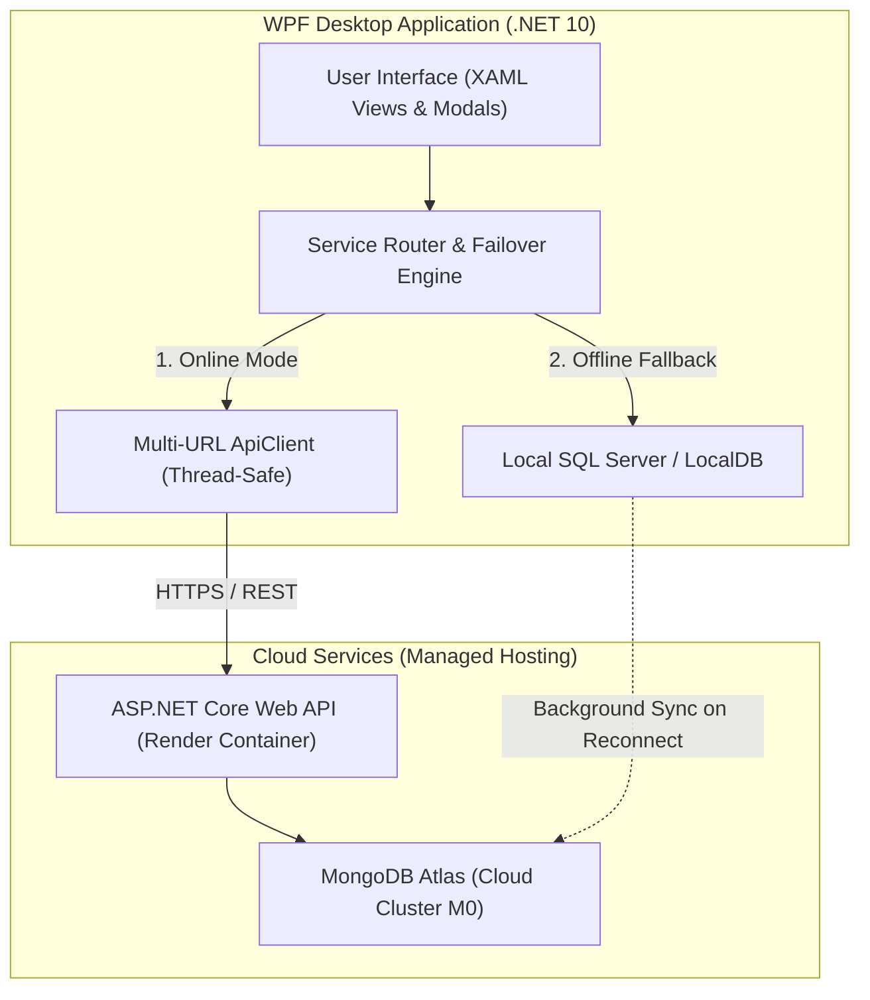

# LogiSyn — Architecture & Technology Decision Rationale

**Module:** Information Systems 3E – Work Integrated Learning (WIL)  
**Module Code:** INSY7315 | Task 2: Code and Implementation  
**Project:** LogiSyn — Production Order Management & Workbook Automation System  
**Client:** Anderson's Bakery  

---

## 1. Executive Summary & Operational Context

Anderson's Bakery operates a commercial wholesale bakery facility supplying fresh, chilled, and frozen baked goods to major supermarket chains (Shoprite, Checkers, Spar) and independent retail outlets. Production runs on strict daily delivery deadlines where delay or equipment halt directly impacts dispatch logistics.

The facility floor operates in an industrial environment subject to:
1. Intermittent or high-latency internet connectivity within metal-clad factory walls.
2. High-volume order consolidation from disparate customer PDF/Excel order sheets.
3. Rigid ingredient recipe scaling (units, pans, trolleys, raw materials) requiring instant computation without cloud round-trip lag.

LogiSyn was engineered with an **offline-first, resilient hybrid architecture** that decouples day-to-day bakery floor operations from cloud service availability while maintaining centralized cloud synchronization whenever network access is active.

---

## 2. High-Level Architecture Diagram

---

## 3. Technology Decision Matrix & Architectural Rationale

### Decision 1: Hybrid Dual-Database Strategy (MongoDB Atlas + Microsoft SQL Server LocalDB)

| Dimension | Chosen Solution | Alternative Considered | Rationale & Trade-Off Analysis |
|:---|:---|:---|:---|
| **Cloud Store** | **MongoDB Atlas** (Document DB) | Relational Cloud DB (Azure SQL / AWS RDS) | Customer bakery orders and recipes have hierarchical, variable structures (nested ingredients, variable batch sizes, method instructions, packaging specs). Document-oriented JSON/BSON structures naturally map to `OrderScaled` and `ProductRow` without extensive multi-table JOIN latency. |
| **Local Store** | **SQL Server LocalDB** / SQLite | Pure in-memory caching / local flat files | Flat files (JSON/CSV) risk corruption during sudden factory power loss or multi-window concurrent writes. SQL Server LocalDB provides full ACID transactions, crash resilience, and relational integrity for offline user credentials and cached orders. |
| **Failover Model** | **Transparent Router Pattern** (`UserServiceRouter`, `LoginServiceRouter`) | Cloud-only or Local-only | Guarantees business continuity: zero downtime for bakers when the cloud internet connection drops or Render experiences cold-start spin-up latency. |

#### Architectural Trade-off (CAP Theorem):
- In distributed systems, LogiSyn prioritizes **Availability and Partition Tolerance (AP)** on the bakery floor over strict global linear consistency. 
- Local operations are never blocked by cloud network timeouts; changes are written locally and reconciled with MongoDB Atlas upon reconnection.

---

### Decision 2: Client Platform — Native WPF Desktop (.NET 10) vs Browser/Web App

| Dimension | Chosen Solution: WPF (.NET 10) | Alternative Considered: Web Application (React / Angular / Blazor) |
|:---|:---|:---|
| **Hardware & Peripherals** | Direct access to operating system APIs for hardware scales, barcode scanners, and thermal label printers without browser sandbox security hurdles. | Restricted by browser security sandbox; cannot directly interface with legacy local bakery hardware or local COM objects. |
| **Document Processing** | In-process high-speed PDF parsing via `PdfPig` and direct Excel generation via `ClosedXML`. Instantaneous memory rendering. | Requires uploading large multipart customer PDFs to a remote web server, consuming cloud bandwidth and incurring upload latency. |
| **Zero-Network Usability** | Native desktop executables run completely offline without an active web server or internet connection. | Web apps require cached service workers, IndexedDB configurations, and a reachable web host to serve assets. |
| **Office Automation** | Native COM late-binding automation for Microsoft Outlook dispatch with seamless fallback to URI schemes (`mailto:`). | Web apps cannot trigger background Outlook COM interop. |

---

### Decision 3: Cloud API Hosting — ASP.NET Core on Render Container

* **Selection:** ASP.NET Core 10 Web API deployed via containerized `Dockerfile` on Render.
* **Why Containerization (Docker):** 
  - Standardizes runtime dependencies across development and production environments.
  - Ensures identical .NET 10 runtime configurations regardless of the host OS.
* **Cold-Start Resilience:**
  - *Challenge:* Free-tier hosting providers (Render) spin down idle containers after 15 minutes of inactivity, producing a 30–50 second cold-start delay on first wake-up.
  - *Engineering Solution:* LogiSyn’s [`ApiClient.cs`](file:///C:/Users/Adria/source/repos/LogiSyn/AndersonsBakeryAPI/Services/ApiClient.cs) incorporates a multi-tiered failover pipeline:
    1. Primary: Cloud endpoint (`https://andersons-bakery-api.onrender.com`).
    2. Secondary: Local developer host (`https://localhost:7274` / `http://localhost:5109`).
    3. Tertiary: Direct local service engine (`LocalDB` / local document fallback).
  - The client UI never freezes during container wake-up; status badges inform the user while the local data layer transparently serves production data.

---

### Decision 4: Cryptographic & Security Architecture

* **Password Hashing:** Implemented using **PBKDF2-HMAC-SHA256** with:
  - 16-byte cryptographically secure random salt generated via `RandomNumberGenerator.GetBytes`.
  - 600,000 hash iterations (meeting and exceeding modern OWASP recommendations).
  - Constant-time verification via `CryptographicOperations.FixedTimeEquals` to prevent side-channel timing attacks.
* **Payload Protection:** 
  - User password hashes are decorated with `[JsonIgnore]` on the `UserRow` model to prevent accidental transmission across API endpoints.
* **Transport Security:**
  - Enforced HTTPS / TLS with strict SSL certificate validation enabled across all API calls in [`ApiClient.cs`](file:///C:/Users/Adria/source/repos/LogiSyn/AndersonsBakeryAPI/Services/ApiClient.cs), strictly rejecting unverified certificates.
* **Role-Based Access Control (RBAC):**
  - Three distinct authorization tiers (`Admin`, `Manager`, `User`) segregating administrative user management, product/recipe modification, and operational bakery floor order processing.

---

### Decision 5: DevOps, CI/CD, and Version Control Strategy

* **Version Control:** Structured Gitflow branching model:
  - `main`: Production-ready, stable releases.
  - `Dev`: Integration branch for completed feature development.
  - `Fix`: Targeted stabilization, refactoring, and security remediation branch.
* **Continuous Integration (CI):** 
  - GitHub Actions workflow ([`.github/workflows/ci-cd.yml`](file:///C:/Users/Adria/source/repos/LogiSyn/.github/workflows/ci-cd.yml)) triggers on every push and pull request.
  - Automatically restores NuGet dependencies, compiles the entire solution (`LogiSyn.slnx`) under `Release` configuration, executes all 19 automated unit tests, and packages deployable application binaries as zipped build artifacts.
* **Verification Guarantee:** 
  - Pull requests and merges are validated against automated test suites to ensure zero regression before deployment.

---

## 4. Summary Evaluation against INSY7315 Criteria

| Rubric Criteria | Architecture Decision & Engineering Implementation |
|:---|:---|
| **Hosting: Stability & Rationale** | Documented hybrid hosting decision matrix; multi-URL failover prevents cloud downtime from affecting operations. |
| **Back End: Database** | Clear separation between cloud document store (MongoDB Atlas) and transactional local store (SQL Server LocalDB). |
| **Back End: Security** | OWASP-compliant PBKDF2 hashing, constant-time validation, HTTPS transport enforcement, and credential leakage prevention. |
| **Back End: Data Flow & Logic** | Complete pipeline: customer PDF parsing $\rightarrow$ recipe ingredient multiplication $\rightarrow$ pan/trolley aggregation $\rightarrow$ production tracking. |
| **GitHub: CI/CD & Pipelines** | Automated GitHub Actions workflow compiling .NET 10 solution, running test suites, and creating release packages. |

